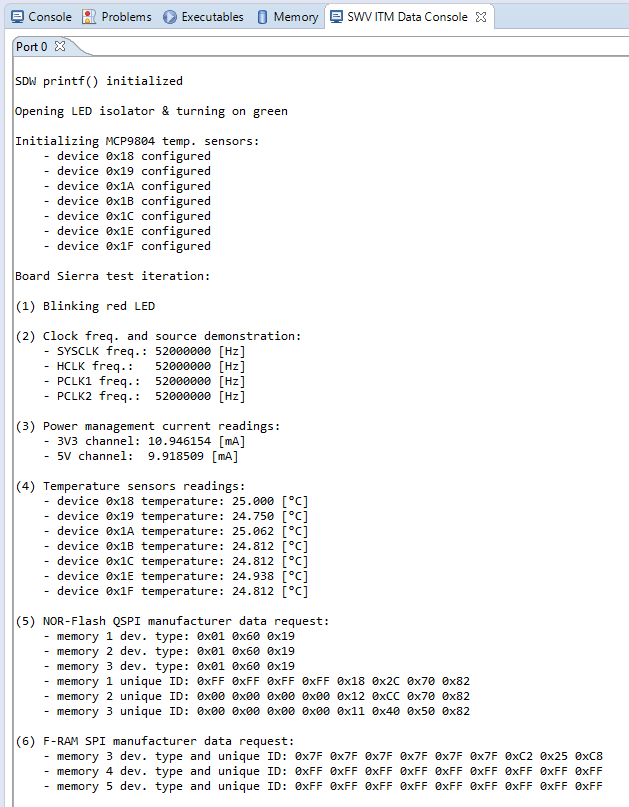

# VST104 Board Sierra Testing 

This repository contains a STM32CubeIDE C++ project. It is designated to test the main features and on-board peripherals of the Sierra board.

## Already implemented:
- open USER1 isolator and light on / flash two added LEDs
- reading and computation of current on 3.3V and 5V E-Fuse
- running on High-Speed External oscillator (HSE) at 52[MHz]
- power on, configure and read the on-board temperature sensors
- read a device type and a unique ID of the FLASH memory chips
- read a device information of the F-RAM memory chips

## To be implemented:
- cross-communication between the on-board CAN-BUS driver
- systematic test of all of the PC104 isolators

## SWD terminal out:
Output of the SWD console  should look like as follows for a correctly behaving board (only F-RAM M4 was assembled):

